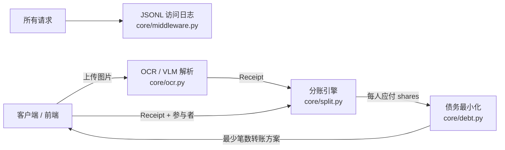

# Expense App — AI 记账分账服务

> 一个生产级练手项目：把「多人聚餐 / 旅行消费」自动拆账，并支持**收据图片 OCR → 一键分账**。
> 涵盖 FastAPI 后端、整数安全分账引擎、最小现金流结算、可插拔 VLM 解析、可观测性与压测。

---

## 技术栈

- **语言/框架**：Python 3.11+ · FastAPI · Pydantic v2 · Uvicorn
- **算法**：整数「分」运算（浮点安全）· 贪心最小现金流（min cash flow）
- **AI 集成**：阿里 DashScope Qwen-VL（OpenAI 兼容模式），Mock 后端可离线运行
- **可观测 / 压测**：Starlette 中间件（JSONL 访问日志）· httpx+asyncio 自研压测 · Locust
- **部署**：Docker · docker-compose（Colima / 任意 OCI 运行时）

---

## 核心能力（对应实现阶段）

| 阶段 | 能力 | 关键文件 |
|------|------|----------|
| 0 | 开发循环：FastAPI + Docker 跑通 `/health` | `main.py` · `Dockerfile` · `docker-compose.yml` |
| 1 | 可解释分账引擎：4 种策略（equal / per_item / proportional / weighted） | `core/split.py` |
| 2 | 债务最小化：N 笔债务压到最少转账笔数 | `core/debt.py` |
| 3 | 算法接成 API：`POST /split`、`POST /settle` | `api/routes.py` |
| 4 | OCR/VLM 收据解析：图片 → 结构化 Receipt（可插拔后端） | `core/ocr.py` |
| 5 | 可观测 + 压测：JSONL 访问日志、QPS/p99 基准 | `core/middleware.py` · `scripts/bench.py` · `locustfile.py` |
| 6 | 多用户鉴权 + 前端看板：注册/登录令牌、SQLite 多用户隔离、单页看板 | `core/auth.py` · `core/db.py` · `api/auth_routes.py` · `static/index.html` |

---

## 架构



### 目录结构

```
my-expense/
├── app/
│   ├── main.py              # FastAPI 实例 + /health + 挂载路由/中间件
│   ├── api/routes.py        # /split /settle /ocr /scan
│   └── core/
│       ├── split.py         # 分账引擎（4 策略 + 整数分运算）
│       ├── debt.py          # 最小现金流结算
│       ├── ocr.py           # 图片 → Receipt（Mock / Qwen-VL 可插拔）
│       └── middleware.py    # JSONL 访问日志
├── tests/                   # pytest：split/debt/api/ocr/observability
├── scripts/bench.py         # 零依赖压测脚本
├── locustfile.py            # 工业级压测（简历/演示）
├── Dockerfile / docker-compose.yml
├── requirements.txt         # 运行时依赖
└── requirements-dev.txt     # 开发期依赖（locust）
```

---

## 工程亮点（面试可讲）

1. **浮点安全**：所有金额内部用「分」(int) 运算，整数除法丢的余数补偿给垫付人，保证总额守恒 —— 规避 `0.1+0.2≠0.3`。
2. **最小现金流**：`settle()` 用贪心算法把 N 笔债务压到最少转账笔数（面试高频白板题），并附 `naive_settle()` 对比基准体现「优化价值」。
3. **策略模式 / 依赖倒置**：OCR 后端用 `OCRBackend` 协议做契约，`MockOCRBackend`（离线）与 `QwenVLOCRBackend`（真实 VLM）是可替换实现；业务只依赖 `extract_receipt()` 抽象，加新引擎零改动调用方（开闭原则）。
4. **可观测性**：一行 `add_middleware` 接入 JSONL 访问日志，默认 stdout（容器日志驱动收集），可切文件落地。
5. **先定位瓶颈再谈扩容**：压测发现 1→4 worker QPS 几乎不变（128→135），判定瓶颈是「压测机与服务器抢同一份受限 CPU」而非应用本身 —— 体现工程判断力。
6. **零依赖鉴权与多用户**：密码 `pbkdf2_hmac` 加盐哈希、令牌 `hmac` 自签名、存储 `sqlite3` —— 全套标准库实现，不引入 jwt/passlib/SQLAlchemy；`get_current_user` 依赖项一行挂上即保护端点，数据按 `user_id` 隔离。

---

## 本地运行

```bash
# 1) 虚拟环境
python -m venv .venv && source .venv/bin/activate
pip install -r requirements.txt

# 2) 跑测试（当前 20 passed）
pytest tests -q

# 3) 起服务
uvicorn app.main:app --port 8080 --reload
# 打开 http://localhost:8080/docs 用 Swagger 调试

# 4) Docker（Colima 等）
colima start            # 若守护进程未起
docker compose up --build   # 访问 http://localhost:8080
```

### 关键环境变量

| 变量 | 作用 | 默认 |
|------|------|------|
| `OCR_BACKEND` | `mock`（离线）或 `qwen`（真实 Qwen-VL） | `mock` |
| `DASHSCOPE_API_KEY` | 启用 `qwen` 后端所需 | 无 |
| `ACCESS_LOG_FILE` | 访问日志落盘路径（不设则打 stdout） | 无 |

---

## API 速览

| 方法 | 路径 | 说明 |
|------|------|------|
| GET | `/health` | 健康检查 |
| POST | `/api/v1/split` | 一张收据 + 参与者 + 策略 → 每人应付 |
| POST | `/api/v1/settle` | 份额 + 垫付者 → 最少笔数转账方案 |
| POST | `/api/v1/ocr` | 上传收据图片 → 结构化 `Receipt` |
| POST | `/api/v1/scan` | 上传图片 + 参与者 → 一步直接出分账结果 |

---

## 简历叙事（可直接用）

**English (for CV):**
> **AI Expense-Sharing Service** (Python, FastAPI, Docker) — Built an end-to-end expense-splitting API. Implemented a float-safe splitting engine (integer-cent arithmetic with remainder compensation) supporting 4 strategies, and a greedy minimum-cash-flow algorithm that minimizes debt transfers. Integrated receipt OCR via an OpenAI-compatible Qwen-VL backend behind a pluggable interface (mock + real), and added JSONL access logging plus a load-test harness (httpx/Locust) — discovering throughput was bounded by co-located load-generator CPU, not app logic.

**中文（面试口述）：**
> 我做了一个 AI 记账分账服务：分账引擎用整数「分」运算避免浮点误差，支持 4 种分摊策略；结算用贪心最小现金流把转账笔数压到最少。收据图片通过可插拔的 OCR 层（Mock + 真实 Qwen-VL）解析成结构化数据，配合访问日志与压测，体现我对工程权衡和瓶颈定位的意识。

---

## 路线图（Roadmap）

- [x] Stage 0–5（环境 / 分账引擎 / 结算 / API / OCR / 可观测压测）
- [x] **Stage 6**：前端看板 + 多用户 / 鉴权（完整可演示产品）
- [x] 接真实 Qwen-VL 跑通 `/scan` 端到端（需 `OCR_BACKEND=qwen` + `DASHSCOPE_API_KEY`）
